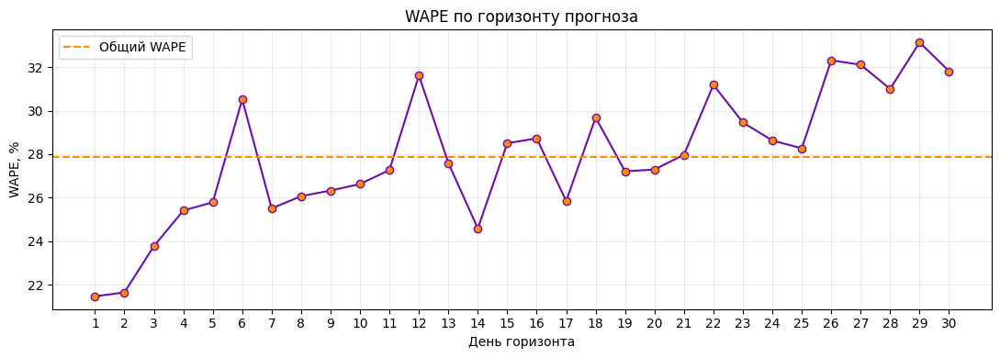
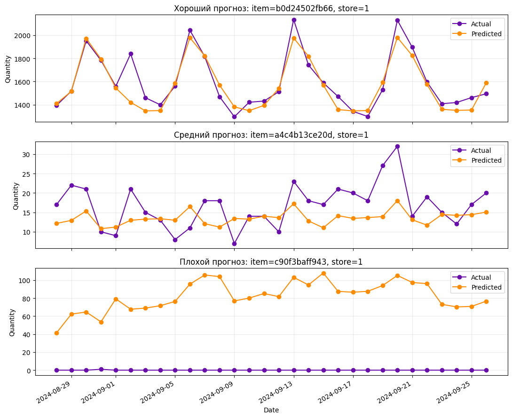
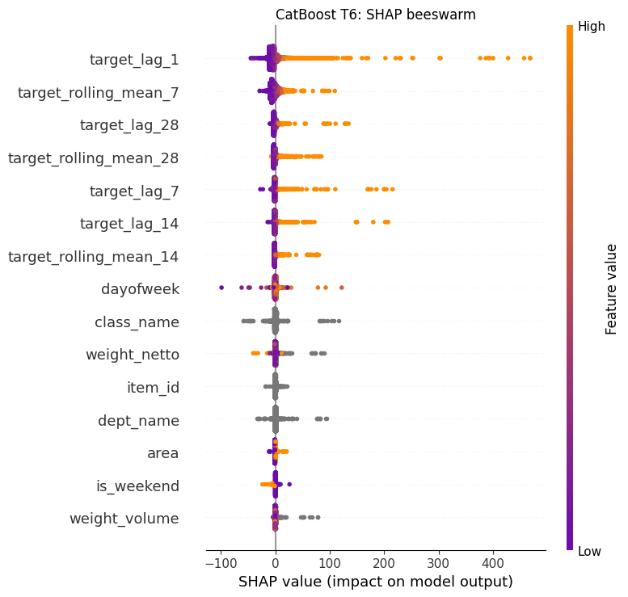
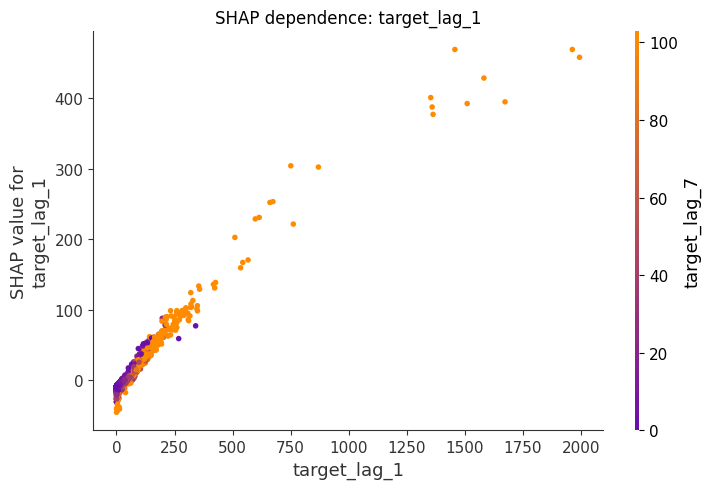

# Retail Demand Forecasting

Проект по прогнозированию спроса на товары в магазинах на 30 дней вперёд.

Основная идея — по истории продаж и признакам товара/магазина предсказывать `quantity` для каждой пары `item_id × store_id`.

Модель строит прогноз рекурсивно: предсказания предыдущих дней используются для расчёта lag- и rolling-признаков следующих дней.


---
---

## Результат

Финальная модель — `CatBoostRegressor`.

На отдельном test-периоде:

| Metric | Result |
|---|---:|
| MAE | 7.806 |
| RMSE | 17.321 |
| WAPE | **27.88%** |

На validation CatBoost снизил WAPE с `36.81%` у Seasonal Naive до `30.52%`.

---
---

## Данные

Используются готовые parquet-датасеты:

```text
data/
├── train.parquet
├── valid.parquet
└── test.parquet
```

Разделение сделано по времени:

```text
TRAIN
27.03.2023 — 28.07.2024

VALID
29.07.2024 — 27.08.2024

TEST
28.08.2024 — 26.09.2024
```

Random split здесь не использовался, потому что задача временная.

---
---

## Что делал

По проекту прошёл примерно такой pipeline:

```text
EDA
↓
Time split
↓
Lag / rolling features
↓
Seasonal Naive baseline
↓
Recursive forecasting
↓
Feature ablation
↓
CatBoost vs LightGBM
↓
Hyperparameter tuning
↓
Final test
↓
Error analysis
↓
SHAP
```

---
---

## Признаки

Основные признаки:

```text
target_lag_1
target_lag_7
target_lag_14
target_lag_28

target_rolling_mean_7
target_rolling_mean_14
target_rolling_mean_28
```

Также использовались:

- день недели и выходные;
- характеристики товара;
- категория товара;
- характеристики магазина.

---
---

## Recursive forecasting

Обычный `model.predict(valid)` здесь использовать нельзя.

Если мы прогнозируем сразу 30 дней вперёд, то после первого дня настоящие значения `target` уже неизвестны.

Поэтому схема такая:

```text
история
↓
prediction day 1
↓
prediction добавляется в историю
↓
пересчитываются lag / rolling
↓
prediction day 2
↓
...
↓
day 30
```

Так validation имитирует реальный 30-дневный прогноз и не использует будущие значения target.

---
---

## Baseline

В качестве baseline использовал Seasonal Naive:

```text
prediction(t) = quantity(t - 7)
```

На validation:

```text
WAPE = 36.81%
```

---
---

## Feature experiments

Проверял несколько наборов признаков:

| Experiment | WAPE |
|---|---:|
| Seasonal Naive | 36.81% |
| Lags + Calendar | 31.96% |
| + Rolling | 32.78% |
| + Product / Store | **30.89%** |

Интересный момент: rolling-признаки отдельно качество не улучшили, а признаки товара и магазина дали дополнительный сигнал.

---
---

## Сравнение моделей

| Model | WAPE |
|---|---:|
| Seasonal Naive | 36.81% |
| **CatBoost** | **30.89%** |
| LightGBM | 39.70% |

CatBoost оказался заметно лучше LightGBM, поэтому дальше тюнил только его.

---
---

## Tuning

Лучшая конфигурация:

```python
CatBoostRegressor(
    iterations=1000,
    learning_rate=0.05,
    depth=8,
    l2_leaf_reg=10,
    loss_function="MAE",
    random_seed=42,
)
```

Validation WAPE после tuning:

```text
30.52%
```

После этого параметры были зафиксированы и модель переобучена на `train + valid`.

---
---

## Error analysis

На test видно, что ошибка в целом растёт с увеличением горизонта прогноза.

В начале WAPE примерно `21–25%`, ближе к концу часто выше `30%`.

Это ожидаемо для recursive forecasting: ошибки предыдущих predictions постепенно попадают в признаки следующих дней.

<p align="center">
  
</p>

Также модель нормально ловит общий уровень спроса, но часто сглаживает резкие пики и провалы.

<p align="center">
  
</p>

---
---

## SHAP

SHAP показал, что модель в основном опирается на недавнюю историю спроса.

Самые важные признаки:

| Feature | Mean \|SHAP\| |
|---|---:|
| `target_lag_1` | 10.08 |
| `target_rolling_mean_7` | 6.20 |
| `target_lag_28` | 3.03 |
| `target_rolling_mean_28` | 2.75 |
| `target_lag_7` | 2.50 |

То есть сильнее всего на прогноз влияет спрос предыдущего дня и недавний уровень продаж.

<p align="center">
  
  
</p>

---
---

## Ограничения

Основные проблемы текущего решения:

- ошибка постепенно накапливается на длинном горизонте;
- модель сглаживает резкие пики;
- смена ассортимента может ломать прогноз;
- внешних факторов пока немного.

---
---

## Структура

```text
retail-demand-forecasting/
├── data/
│   ├── train.parquet
│   ├── valid.parquet
│   └── test.parquet
├── notebooks/
│   └── build_model.ipynb
├── models/
│   └── catboost_t6.cbm
├── requirements.txt
└── README.md
```

---
---

## Запуск

```bash
pip install -r requirements.txt
jupyter notebook
```

Основной notebook:

```text
notebooks/build_model.ipynb
```
---
---
---


